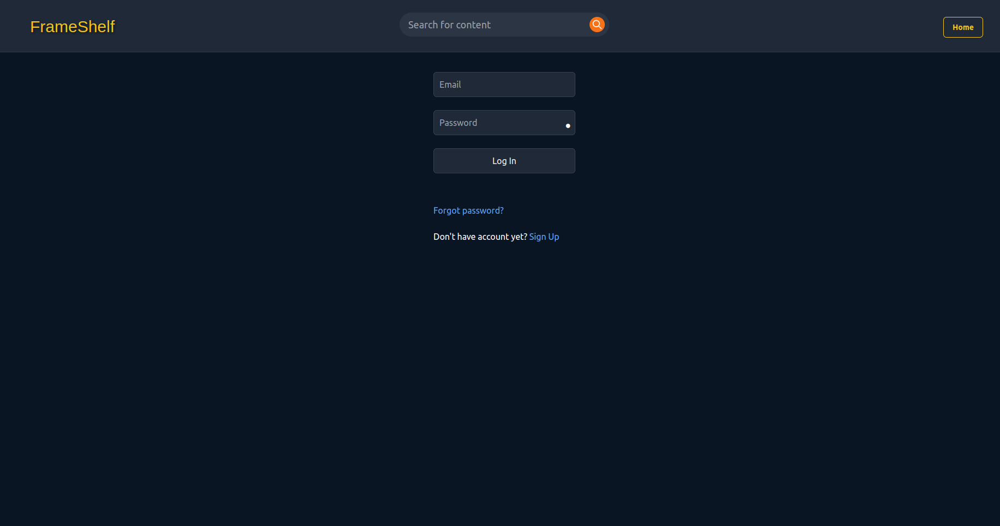
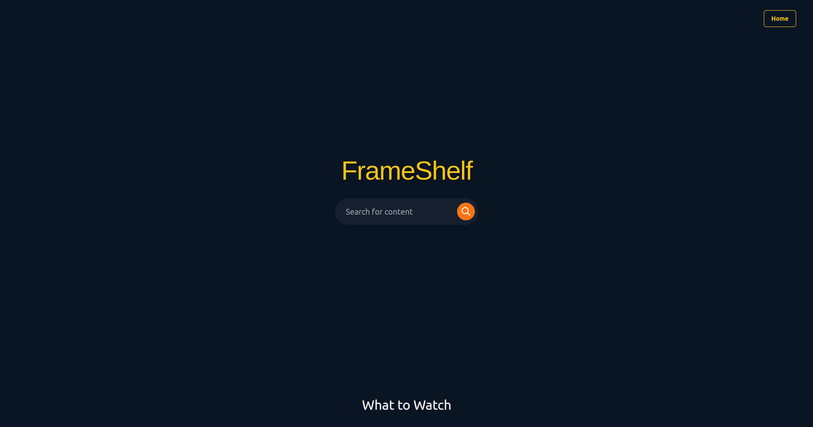
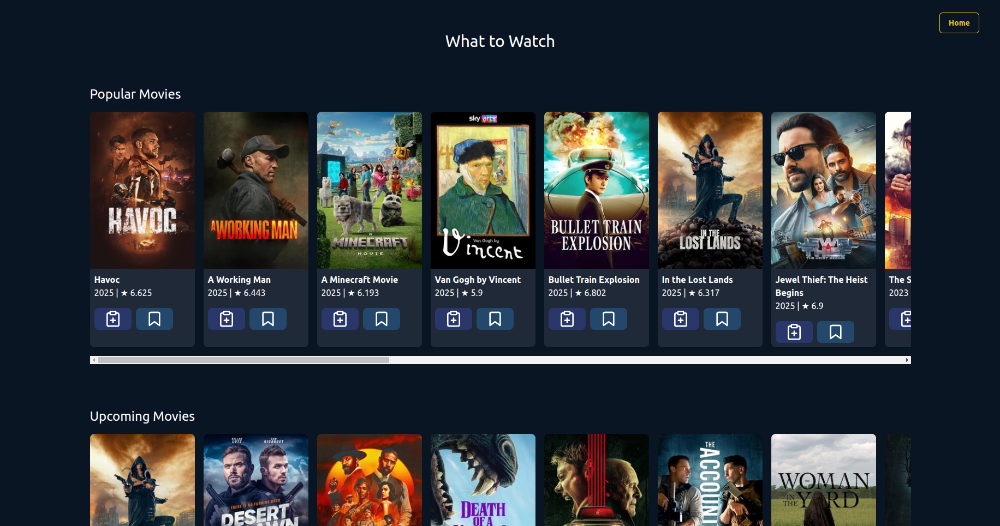
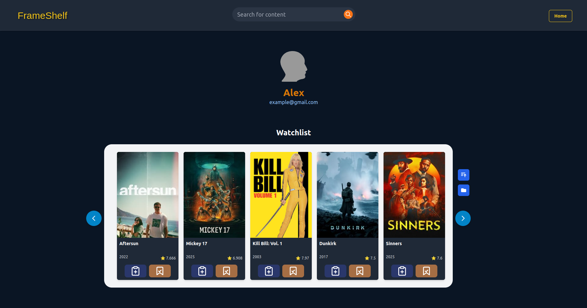
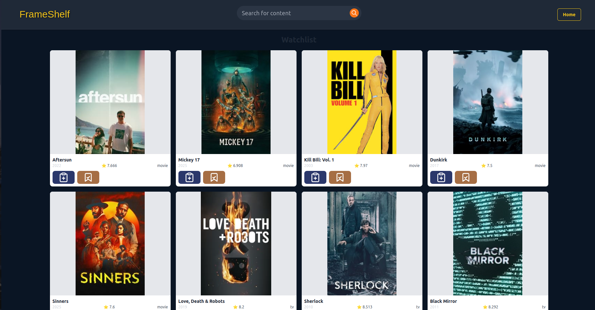
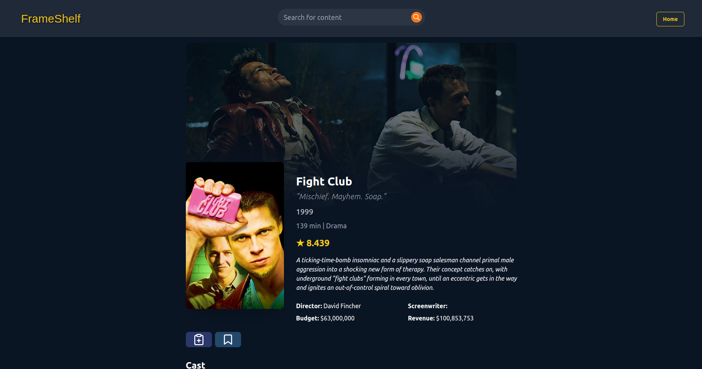
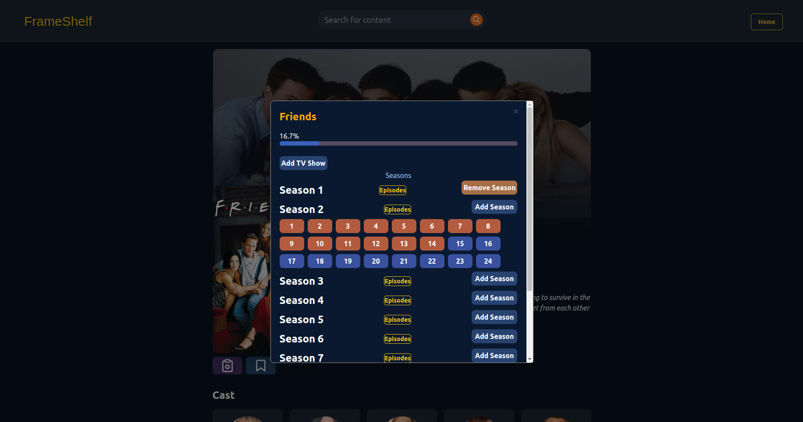
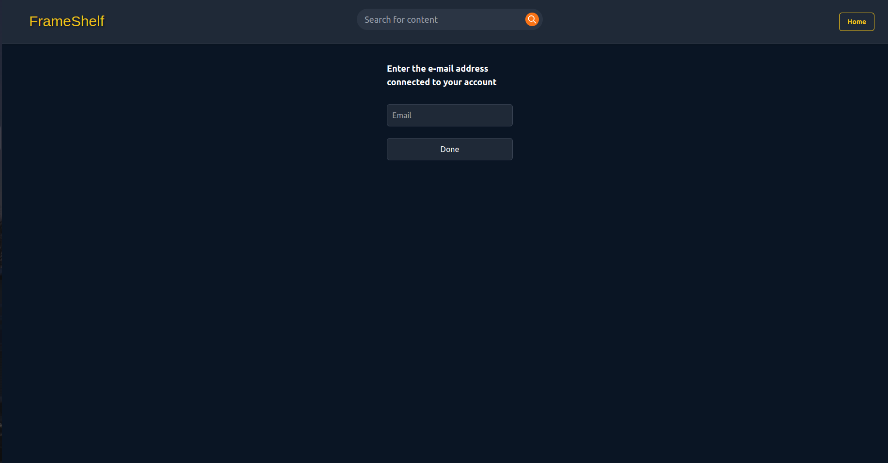

<h1 align="center"> FrameShelf</h1>

## Описание
FrameShelf - медиа трекер, позволяющий отслеживать фильмы и сериалы, добавляя их в соответствующие списки.

 ## Реализовано
 1. Авторизация/Регистрация. JWT.
 2. Главная страница с которой можно начать поиск контента и есть раздел с популярными на данный момент фильмами и сериалами (данные на этой странице кэшируются и обновляются раз в сутки).
 3.  Домашняя страница  со списками. Списки можно сортировать по рейтингу, дате релиза и дате добавления.
 4. Отдельная страница для каждого списка с динамической загруской контента.
 5. Страница контента с его данными.
 6. Возможность добавления сезонов и епизодов отдельно (у сериала).
 7. Возможность сброса пароля через электронную почту.

## Стек технологий
- FastAPI
- PostgreSQL
- SQLAlchemy
- Pydantic
- Redis
- Celery
- aiohttp
- Alembic
- Tailwind CSS
- htmx
- Docker, docker-compose

## Запуск проекта локально

1) Клонируйте репозиторий:
```
git clone https://github.com/Lock323/FrameShelf.git
cd FrameShelf
```

2) Создайте .env файл:
```
cp .env.example .env
```
Заполните .env своими значениями.

3) Соберите и запустите контейнеры:
```
docker-compose up --build
```

4) Откройте проект в браузере:
```
http://localhost:9996
```

## Реализовано (с картинками)

1. Авторизация/Регистрация. JWT.


2. Главная страница с которой можно начать поиск контента и есть раздел с популярными на данный момент фильмами и сериалами (данные на этой странице кэшируются и обновляются раз в сутки).


  
3. Домашняя страница  со списками. Списки можно сортировать по рейтингу, дате релиза и дате добавления.


 4. Отдельная страница для каждого списка с динамической загруской контента.


 5. Страница контента с его данными.


 6. Возможность добавления сезонов и епизодов отдельно (у сериала).


 7. Возможность сброса пароля через электронную почту.
